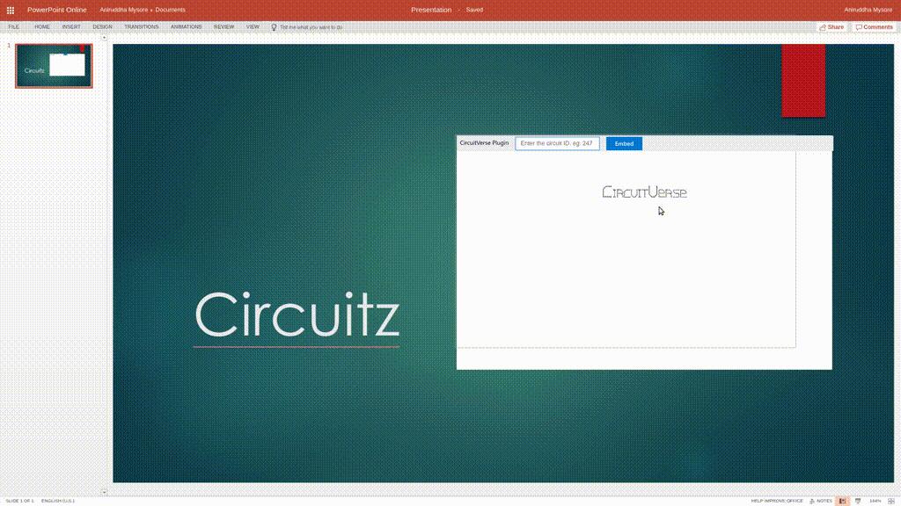

# CircuitVersePPT

**Still in testing mode. Currently works for office online**

1. Install dependencies with `npm` and then run `npm start`
2. Add the self signed certificate file `certs/ca.crt` to your system. 

    **Instructions for Chrome Users**: Click on **Manage Certificates** in settings and import the certifcate under **Authorities** tab.

3. Open Office online, open a new Powerpoint presentation, **Insert** Tab -> **Office Add-Ins** -> **Manage My Add-ins** -> **Upload My Add in** 

    Upload the `manifest.xml` file from this repository

    If the server is running, you should see the add in show up on screen.

4. Type the Circuit ID in the text input and click embed. 